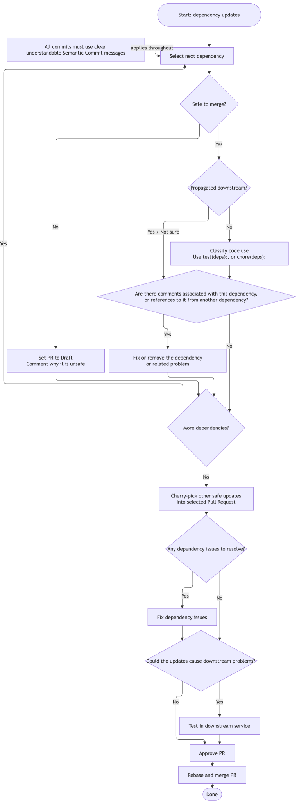

# Maintaining sda-spring-boot-commons

This document describes how maintainers handle dependency updates and merge Pull Requests.

## Dependency Updates

Review every dependency update before merging it. Do not rely on automated updates alone.

Especially for smaller libraries, read the release notes and check:

- Could this update introduce a security risk?
- Could this update break this project or a consuming service?

Use the following process for open dependency update Pull Requests:

Dependency update flow

1. Select one dependency update.
2. Decide whether it is safe to merge.

- If it is not safe, change the Pull Request to draft and comment why it is unsafe.
- If it is safe, continue with the next checks.

3. Check whether the dependency is propagated to downstream services. Classify the dependency and
   replace the generated commit message when necessary. Follow the
   [guidelines and commit message rules](#commit-messages).

4. Check for comments associated with the dependency or references to it from another dependency.
   Resolve or remove the dependency or related problem before continuing.
5. Repeat this process for every open dependency update.

When several updates are safe, select one Pull Request and cherry-pick every other safe update into
it. Configure automerge to rebase. Otherwise, release notes may not describe every update.

Resolve dependency issues in the combined Pull Request. If an update could cause downstream
problems, test it in a downstream service before approving it.

This repository is public and does not enable automerge by default. After approval, enable automerge
or merge manually. Rebase before merging.

Choose `Rebase and Merge` to ensure release notes describe every relevant update.

## Commit Messages

All commits must use clear,
understandable [Semantic Commits](https://gist.github.com/stephenparish/9941e89d80e2bc58a153)
messages.

For dependency updates:

- Use `fix(deps):` when the dependency is used in production code, is propagated to downstream
  services, or you are unsure.
- Use `test(deps):` when the dependency is only used by tests and is not propagated downstream.
- Use `chore(deps):` only when the dependency is used in neither production nor test code and is not
  propagated downstream.

A test dependency declared with Gradle's `api` configuration is propagated downstream. Use
`fix(deps):` for that update.

## Pull Request Reviews

Reviews improve correctness, readability, style, and documentation, including missing documentation.
Review all ticket requirements and commit messages.

Mark review findings so authors can prioritize them:

- Start non-negotiable bugs or violations of SDA or team conventions with `Must: `.
- Start negotiable implementation or style suggestions with `Optional: `.

One commit per review--adapt--re-review cycle is usually
enough. Use a dedicated commit when feedback requires a large or complex change.
