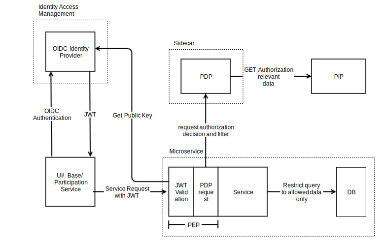

# sda-commons-web-starter

The `sda-commons-web-starter` provides several features to provide a service based
on the SDA core concepts.

Features:
  - [Authentication](#authentication)
  - [Authorization](#authorization)
  - [Http Client](#http-client)
  - [Async Request Context](#async)
  - [Jackson Object Mapping](#jackson)
  - [Monitoring](#monitoring)
  - [Tracing](#tracing)
  - [Health Checks](#health-checks)

###  Configuration
| **Property**                             | **Description**                                                                | **Default**                                                          | **Example**                              | **Env**                         |
|------------------------------------------|--------------------------------------------------------------------------------|----------------------------------------------------------------------|------------------------------------------|---------------------------------|
| `auth.issuers` _string_                  | Comma separated string of open id discovery key sources with required issuers. |                                                                      | `https://iam-int.dev.de/auth/realms/123` | `AUTH_ISSUERS`                  |
| `auth.disable` _boolean_                 | Disables authorization checks completely.                                      | `false`                                                              | `true`                                   | `AUTH_DISABLE`                  |
| `opa.disable` _boolean_                  | Disables authorization checks with Open Policy Agent completely.               | `false`                                                              | `true`                                   | `OPA_DISABLE`                   |
| `opa.base.url` _string_                  | The baseUrl of OPA.                                                            | `http://localhost:8181`                                              | `http://opa-service:8181`                | `OPA_BASE_URL`                  |
| `opa.policy.package` _string_            | The policy package to check for authorization.                                 | Defaults to package name of `@SpringBootApplication` annotated class | `com.custom.package.name`                | `OPA_POLICY_PACKAGE`            |
| `opa.exclude.patterns` _string_          | Custom excluded paths can be configured as comma separated list of regex.      | `openapi.json` and `openapi.yaml `                                   | `/customPathOne,/customPathTwo`          | `OPA_EXCLUDE_PATTERNS`          |
| `opa.client.connection.timeout` _string_ | The connection timeout of the client that calls the Open Policy Agent server.  | `500ms`                                                              | `2s`                                     | `OPA_CLIENT_CONNECTION_TIMEOUT` |
| `opa.client.timeout` _string_            | The read timeout of the client that calls the Open Policy Agent server.        | `500ms`                                                              | `2s`                                     | `OPA_CLIENT_TIMEOUT`            |

## Web

The list of web configuration: 

- The`server.servlet.context-path` defaults to `/api`
- The`server.port` defaults to `8080`
- The`managment.server.port` defaults to `8081`
- The `openapi.yaml` is available under `/api/openapi.yaml`
- To enable [JSON logging](../../sda-commons-web-autoconfigure/src/main/resources/org/sdase/commons/spring/boot/web/logging/logback-json.xml)
  you need to set the property `logging.config`to `classpath:org/sdase/commons/spring/logging/logback-json.xml`

## Authentication

- [Spring Security Documentation](https://docs.spring.io/spring-boot/docs/current/reference/htmlsingle/#web.security)

Enables features that make a Spring Boot service compliant with the
[SDA SE Authentication](https://sda.dev/core-concepts/security-concept/authentication/)
and [SDA SE Authorization](https://sda.dev/core-concepts/security-concept/authorization/) concepts
using OIDC and Open Policy Agent.

OIDC Authentication can be configured with `auth.issuers` to provide a comma separated
list of trusted issuers. In develop and test environments, the boolean `auth.disable` may
be used to disable authentication.

The JWKS URI of each issuer is updated when an unknown Key ID is received and every 5 minutes. The
cache of known JWK is invalidated after 15 minutes.

**This setup allows authenticated and anonymous requests! It is the responsibility of policies
provided by the Open Policy Agent to decide about denying anonymous requests.**

Spring Security is disabled for the Management/Admin Port (default: 8081). Be aware that these port
should not be accessible out of the deployment context.

## Authorization

The authorization is done by the [Open Policy Agent](https://www.openpolicyagent.org/). 

The OPA configuration acts as a client to the Open Policy Agent and is hooked in as request filter (
Access Decision Manager) which is part of the `SecurityFilterChain` including the OIDC
Authentication.

Constraints provided with the Open Policy Agent response can be mapped to a custom POJO. If the
class extends `AbstractConstraints` and is annotated with `@Constraints` it can be
`@Autowired` in `@Controllers` or `@RestControllers`.

```java
@Constraints
public class MyConstraints extends AbstractConstraints {

  private boolean admin;

  public MyConstraints setAdmin(boolean admin) {
    this.admin = admin;
    return this;
  }

  public boolean isAdmin() {
    return admin;
  }
}
```
```java
@RestController
public class AuthTestApp {

  @Autowired private MyConstraints myConstraints;
  ...
```

### Testing

TODO

### OPA 


The OPA configuration requests the policy decision providing the following inputs

* HTTP path as Array
* HTTP method as String
* validated JWT (if available)
* all request headers

_Remark to HTTP request headers:_  
The configuration normalizes header names to lower case to simplify handling in OPA since HTTP
specification defines header names as case-insensitive.
Multivalued headers are not normalized with respect to the representation as list or single string
with separator char.
They are forwarded as parsed by the framework.

_Security note:_
Please be aware while a service might only consider one value of a specific header, the OPA is able
to authorize on a array of those.
Consider this in your policy when you want to make sure you authorize on the same value that a
service might use to evaluate the output.

These [inputs](../../sda-commons-web-autoconfigure/src/main/java/org/sdase/commons/spring/boot/web/auth/opa/model/OpaInput.java)
can be accessed inside a policy `.rego`-file in this way:

```rego
# each policy lies in a package that is referenced in the configuration of the OpaBundle
package example

# decode the JWT as new variable 'token'
token = {"payload": payload} {
    not input.jwt == null
    io.jwt.decode(input.jwt, [_, payload, _])
}

# deny by default
default allow = false

allow {
    # allow if path match '/contracts/:anyid' 
    input.path = ["contracts", _]

    # allow if request method 'GET' is used
    input.httpMethod == "GET"

    # allow if 'claim' exists in the JWT payload
    token.payload.claim

    # allow if a request header 'HttpRequestHeaderName' has a certain value 
    input.headers["httprequestheadername"][_] == "certain-value"
}

# set some example constraints 
constraint1 := true                # always true
constraint2 := [ "v2.1", "v2.2" ]  # always an array of "v2.1" and "v2.2"
constraint3[token.payload.sub].    # always a set that contains the 'sub' claim from the token
                                   # or is empty if no token is present

```

The response consists of two parts: The overall `allow` decision, and optional rules that represent _constraints_ to limit data access
within the service. These constraints are fully service dependent and MUST be applied when querying the database or
filtering received data.

The following listing presents a sample OPA result with a positive allow decision and two constraints, the first with boolean value and second
with a list of string values.
```json
{
  "result": {
    "allow": true,
    "constraint1": true,
    "constraint2": [ "v2.1", "v2.2" ],
    "constraint3": ["my-sub"]
  }
}
```

###  Configuration Properties

- `opa.disable` _boolean_
  - Disables authorization checks with Open Policy Agent completely. In this case access to all
    resources is granted but no constraints are provided.
- `opa.base.url` _string_
  - The base url of the Open Policy Agent Server. Defaults to `http://localhost:8181`.
    Requests to the server are determined by the base URL and the policy package. Given the default
    base URL `http://localhost:8181` and an example package of `com.my.service`, the Open Policy Agent
    server will be requested for authorization decision
    at `http://localhost:8181/v1/data/com/my/package`
- `opa.policy.package` _string_
  - The policy package to check for authorization. It will be reformatted to a URL path to request
    the authorization form the Open Policy Agent server. Example: `com.my.service`. If the policy
    package is blank, the package of the application class (the first bean found that is annotated
    with `@SpringBootApplication`) is used as a default. Be aware that moving the class causes a
    breaking change regarding deployment if the package is not explicitly set.
    Requests to the server are determined by the base URL and the policy package. Given the default
    base URL `http://localhost:8181` and an example package of `com.my.service`, the Open Policy Agent
    server will be requested for authorization decision
    at `http://localhost:8181/v1/data/com/my/package`
- `opa.exclude.patterns` _string_
  - `/openapi.yaml` and `/openapi.json` are excluded from authorization requirements. Custom excluded
    paths can be configured as comma separated list of regex. This will overwrite the default
    excludes of the OpenAPI documentation paths.
- `opa.client.timeout` _string_
  - The read timeout of the client that calls the Open Policy Agent server. Defaults to 500ms.
- `opa.client.connection.timeout` _string_
  - The connection timeout of the client that calls the Open Policy Agent server. Defaults to 500ms.

## Http Client

## Error Handling

The `sda-commons-web-starter` provides a shared `ApiError` model, to provide a common
response error structure for SDA-restful services.

### Usage

Per default, the `sda-commons-web-starter` autoconfigures a
global `@ExceptionHandler(ApiException.class)` as `@ControllerAdvice`. As a result, the
exception handler is per default provided to every `@Controller`.

#### Referencing in OpenAPI

To provide the common `ApiError` in the API, you need to reference the class as `@Schema`.

```
@ApiResponse(
    responseCode = "422",
    description =
        "The request could not be processed due to invalid parameters. Details are provided in the error response.",
    content = @Content(schema = @Schema(implementation = ApiError.class)))
```

#### Throwing ApiException

When the `ApiException` is thrown the `@ExceptionHandler` automatically intercepts the exception and
maps the related `ResponseEntity`. As the result, the controller returns the related http response
code and the nested `ApiError`.

```
    throw ApiException.builder()
      .httpCode(422)
      .title("Invalid input")
      .detail("name", "name was not null", "NOT_NULL")
      .cause(e)
      .build();
```

In this example the controler would return with http status `422` and body:

```json
{
  "title": "Invalid input",
  "invalidParams": [
    {
      "field": "name",
      "reason": "name was not null",
      "errorCode": "NOT_NULL"
    }
  ]
}
```

## Async

The default Spring async task executor is autoconfigured to transfer the request attributes of the
current request to the thread running the asynchronous method.

## Jackson

Enables features that make a Spring Boot service compliant with
the [SDA SE RESTful API Guide](https://sda.dev/core-concepts/communication/restful-api-guide/) .
So far this covers:
- the tolerant reader pattern
- consistent serialization of java.time.ZonedDateTime compatible to the type date-time of JSON-Schema.
  It is strongly recommended to use
  - `java.time.LocalDate` for dates without time serialized as `2018-09-23`
  - `java.time.ZonedDateTime` for date and times serialized as `2018-09-23T14:21:41+01:00`
  - `java.time.Duration` for durations with time resolution serialized as `P1DT13M`
  - `java.time.Period` for durations with day resolution serialized as `P1Y2D`

All these types can be read and written in JSON as ISO 8601 formats.
Reading `java.time.ZonedDateTime` is configured to be tolerant so that added nanoseconds or missing
milliseconds or missing seconds are supported.
`@com.fasterxml.jackson.annotation.JsonFormat(pattern = "...")` should not be used for customizing
serialization because it breaks tolerant reading of formatting variants. If a specific field should
be serialized with milliseconds, it must be annotated with
`@com.fasterxml.jackson.databind.annotation.JsonSerialize(using = Iso8601Serializer.WithMillis.class)`
. If a specific field should be serialized with nanoseconds, it must be annotated with
`@com.fasterxml.jackson.databind.annotation.JsonSerialize(using = Iso8601Serializer.WithNanos.class)`

## Monitoring

## Tracing

## Health Checks
